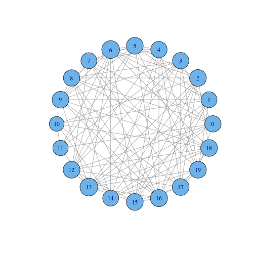
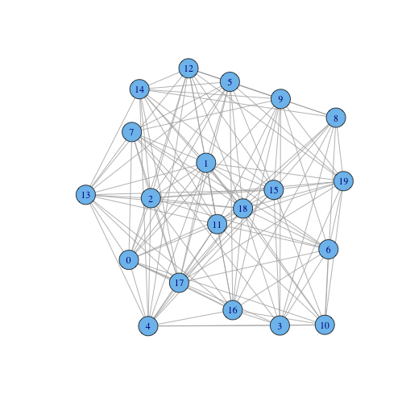

Coursera Discrete Optimization HW - Graph Coloring
==================================================

Coursera course: [Discrete Optimization (session 2, March 2014)](https://class.coursera.org/optimization-002)

This is to visualize and get a sense of the assignment's data sets.

Usage:

1. Run RStudio
1. Load up `README.Rmd`
1. Modify `processData` function below to set the working directory to be the root of your assignment (where the `data/` directory can be found)
1. Click "Knit HTML" (or hit Shift-Command-H on Mac)

---


```r
if (!require("igraph")) {
    install.packages("igraph", repos = "http://cran.rstudio.com/")
    library("igraph")
}
```

```
## Loading required package: igraph
```


Helpers
-------


```r

processData = function(dataFile, display = T) {
    setwd("~/cabinet/Personal/Education/2014 Coursera Discrete Optimization/hw/src/coloring")
    Table = read.table(dataFile, header = T)
    
    # (Note: if we had read in the data from file directly via `read.graph`, not
    # only would we not have been able to skip the header line but igraph would
    # have changed the node indexes to 1-based indexing by adding 1 to every
    # ID.)
    G = graph.data.frame(Table, directed = F)
    
    if (display) {
        plot(G)
    }
    
    hist(degree(G))
}
```


gc_20_1
-------


```r
processData("data/gc_4_1")
```

  

```r
processData("data/gc_20_1")
```

  

```r
processData("data/gc_20_5")
```

  

```r
processData("data/gc_20_9")
```

  

```r
processData("data/gc_50_1")
```

  

```r
processData("data/gc_50_9")
```

  

```r
processData("data/gc_70_9", F)
```

 

```r
processData("data/gc_100_7", F)
```

 

```r
processData("data/gc_250_5", F)
```

 

```r
processData("data/gc_500_3", F)
```

 

```r
processData("data/gc_1000_1", F)
```

 


