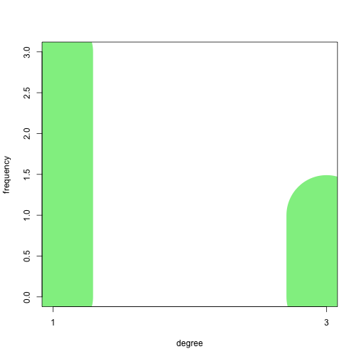
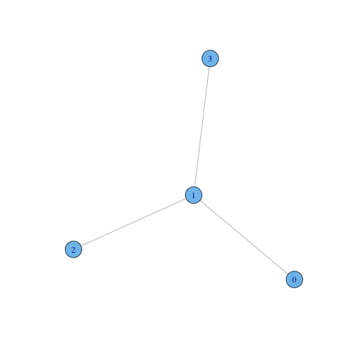
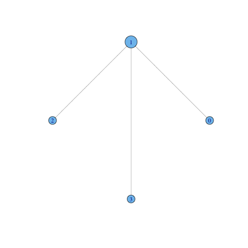
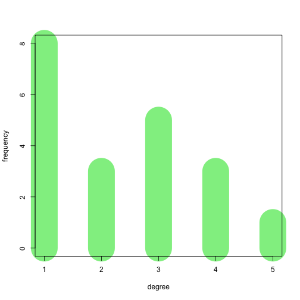
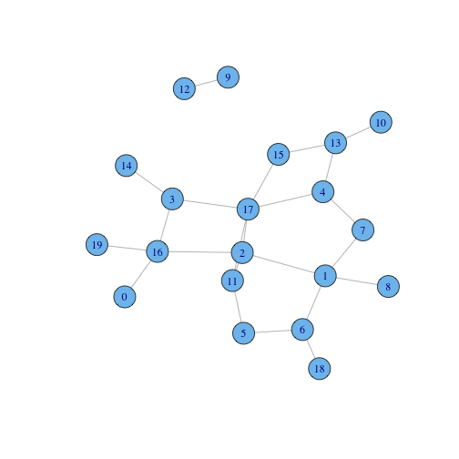
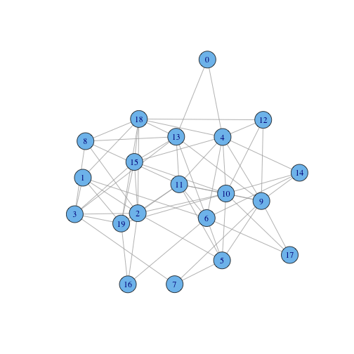
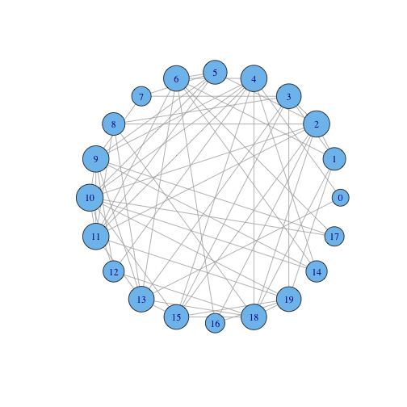
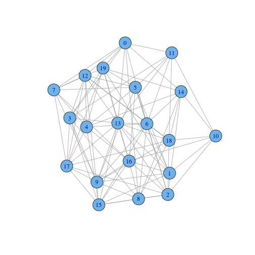
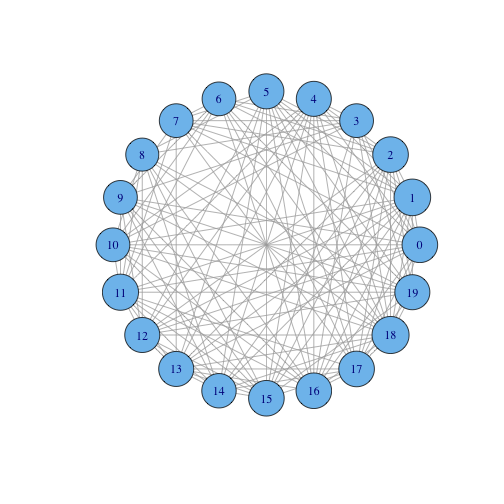
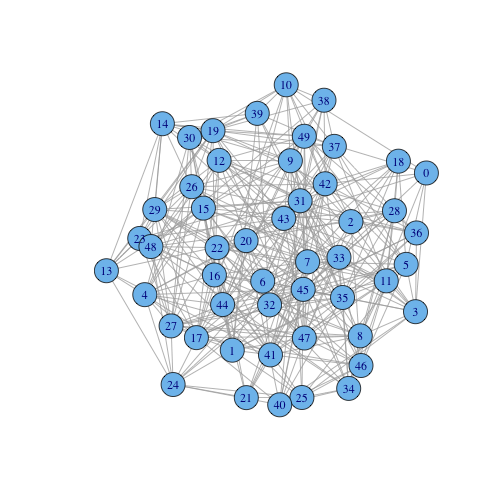

Coursera Discrete Optimization HW - Graph Coloring
==================================================

Coursera course: [Discrete Optimization](https://www.coursera.org/course/optimization) ([session 2](https://class.coursera.org/optimization-002), March 2014)

This is to visualize and get a sense of the assignment's data sets.

Usage
-----

1. Run RStudio
1. Load up `README.Rmd`
1. Modify `processData` function below to set the working directory to be the root of your assignment (where the `data/` directory can be found)
1. Click "Knit HTML" (or hit Ctrl-Shift-H)
1. All the figures below will be regenerated

When you have a solution and you want to color the graph with your solution

1. Change `colorSolution` below to `T`
1. Save your output file with the same name as the data file plus the '.output' extension; e.g., data/gc_20_1.output
1. Re-run "Knit HTML"

---


```r

# If colorSolution is set to T, and output file is available with the same
# name as the data file plus the '.output' extension (e.g.,
# data/gc_20_1.output), then this R script will color the graph with your
# solution.
colorSolution = F

if (!require("igraph")) {
    install.packages("igraph", repos = "http://cran.rstudio.com/")
    library("igraph")
}
```

```
## Loading required package: igraph
```


Helpers
-------


```r

processData = function(dataFile, display = T) {
    setwd("~/cabinet/Personal/Education/2014 Coursera Discrete Optimization/hw/src/coloring")
    Table = read.table(dataFile, header = T)
    
    # (Note: if we had read in the data from file directly via `read.graph`, not
    # only would we not have been able to skip the header line but igraph would
    # have changed the node indexes to 1-based indexing by adding 1 to every
    # ID.)
    G = graph.data.frame(Table, directed = F)
    
    # hist(degree(G), col='lightgreen')
    
    degreeTable = table(degree(G))
    lineWidth = 300/length(degreeTable)
    plot(degreeTable, type = "h", xlab = "degree", ylab = "frequency", col = "lightgreen", 
        lwd = lineWidth)
    
    # Visualize a solution's output, if any
    outputFile = paste(dataFile, ".output", sep = "")
    if (colorSolution & file.exists(outputFile)) {
        Nodes = scan(outputFile, skip = T)
        # Add 2 because we don't want the black color (1)
        Nodes = Nodes + 2
        
        # Re-order colors because igraph doesn't have the vertices in the right
        # order
        Colors = vector()
        vertices = V(G)
        for (i in 1:length(vertices)) {
            Colors[i] = Nodes[as.numeric(vertices[i]$name) + 1]
        }
        
        # Store colors in graph for plotting
        V(G)$color = Colors
    }
    
    if (display) {
        plot(G)
        plot(G, layout = layout.circle, vertex.size = 10 + 5 * log(degree(G)))
    }
    
}
```


Datasets
--------


```r
processData("data/gc_4_1")
```

   

```r
processData("data/gc_20_1")
```

   

```r
processData("data/gc_20_3")
```

   

```r
processData("data/gc_20_5")
```

   

```r
processData("data/gc_20_7")
```

   

```r
processData("data/gc_20_9")
```

   

```r
processData("data/gc_50_3")
```

   

```r
processData("data/gc_70_7", F)
```

 

```r
processData("data/gc_100_5", F)
```

 

```r
processData("data/gc_250_9", F)
```

 

```r
processData("data/gc_500_1", F)
```

 

```r
processData("data/gc_1000_5", F)
```

 


